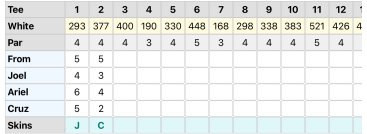
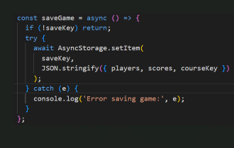
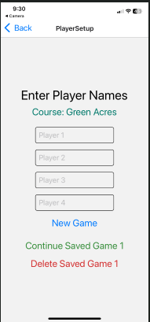
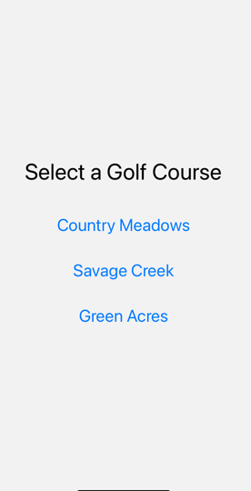
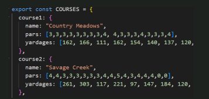
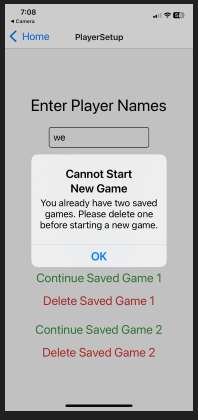

# 3UnderGolf Dev Log

---

## Week 1

- Continuing where I left off from my mobile app assignment. 

- **Skins Winner Logic:**  
  Used `.map` to identify and render the winner’s initials for each hole. Decided to display the first letter of each player’s name for clarity. Considered two characters, but it would crowd the box—players should ensure unique initials.



- **Saving Changes:**  
  I noticed the scorecard resets when navigating away. Integrated AsyncStorage to persist scores and player data.
  - Installed:  
    ```bash
    npx expo install @react-native-async-storage/async-storage
    ```
  - State is loaded from AsyncStorage on mount.
  - State is saved to AsyncStorage whenever players or scores change.
  - Added a reset button to clear saved state.
  - If you navigate away and return, the state is restored.
- **Save/Load Issues:**  
  Initial save/load functions didn’t persist data as expected. Found that using `route.params` when loading reset the existing game.



- **PlayerSetupScreen Improvements:**  
  Removed the old Play Golf button. Added New Game and Continue Saved Game buttons.
  - Needed to clear the saved game with `AsyncStorage.removeItem(Storage_key)` to start a new game; otherwise, the saved game would always load.
  - Considered removing the reset button.
  - Removed the reset button. Users can use the delete a game option and then start a new game



---

## Week 2

- **Multiple Saved Games:**  
  Added the ability to save and delete up to two games per course.
  - Noticed new saved game buttons didn’t show up right away on PlayerSetupScreen.  
    Replacing `useEffect` with `useFocusEffect` fixed this issue.

---


- **Course Selection Screen:**  
  Added a new screen for users to select from three golf courses.  
  - PlayerSetupScreen is called when a course is chosen.
  - Course information is passed and used to format the scorecard.
  - All three courses support loading and deleting up to two games.

  

- **Course Data Structure:**  
  Created an object to store golf course information.  
  - The app passes individual course info using the assigned course key to PlayerSetupScreen and ScorecardScreen.
  - The scorecard is formatted based on the selected course.



---

## Week 3

- **UI Improvements:**  
  - Hid the route/screen names at the top of screens using `options={{ headerShown: false }}`.
  - This also removed the back navigation button; Android users must use the hardware back button.
- **ScrollView Tweaks:**  
  - On PlayerSetupScreen and CourseSelectionScreen, scrolling in landscape snapped to center due to `justifyContent: 'center'` in the container style.
  - Removed `justifyContent: 'center'` and `flex: 1`.
  - Tweaked `container` with `paddingVertical`, `paddingTop`, and adjusted the `title`’s `marginTop`.
- **Delete Confirmation:**  
  - Added a confirmation prompt (`Alert.alert`) before deleting a game.
  - The alert did not work with an async `onPress` directly; fixed by creating a separate function for the alert logic.

  

- **Adding More Courses:**  
  - Added two more golf courses.  
    Adding courses is straightforward—just add a new course object to the `COURSES` array in `courses.js`.

---

## Week 4

- **Custom Icons:**  
  - Downloaded golf icons and favicon from [OpenMoji](https://openmoji.org/) and replaced the built-in Expo icons.

---

*Dev log maintained by Robert Navalta.*
